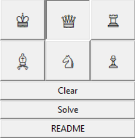
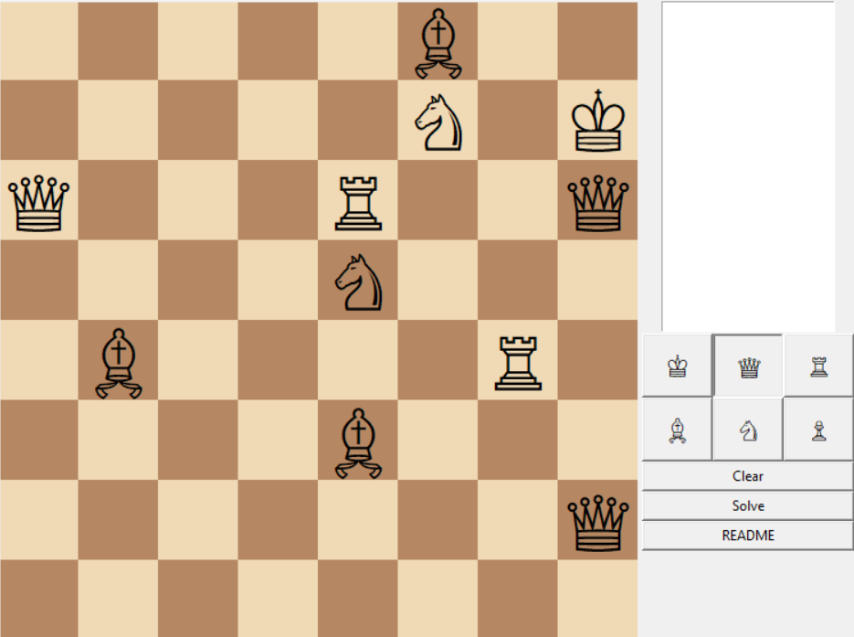
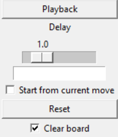
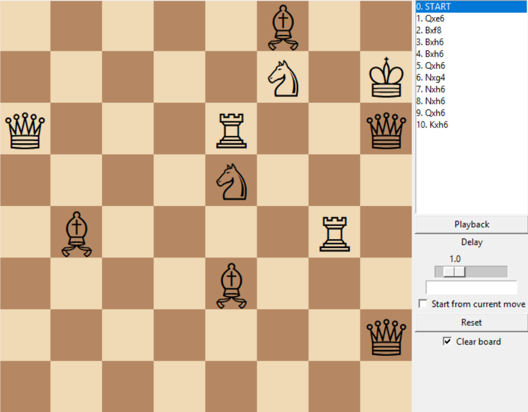

♟️ Solo Chess Solver

🎯 Overview

Solo Chess Solver is a Python puzzle system 
where you build custom chess positions 
and solve them using a rule-based capture engine 
with animated playback.

⚙️ Features

- Interactive chess board editor
- Rule-based solver (capture-sequence logic)
- Move-by-move playback system
- Animation for piece movement
- Move list navigation

🧩 How to use

1. Place pieces on the board
2. Click Solve
3. Watch or step through the solution
4. Use Playback for animation

🖱 Controls

- Left click → place piece
- Right click → remove piece
- Solve → run solver
- Playback → animate solution
- Arrow keys → navigate moves

⚠️ Notes

- Some puzzles have no solution
- This is not a full chess engine
- Designed for puzzle experimentation

⬇️ Install

1. README --> download raw file --> downloads

Or:

2. Chess_Solo_Solver_v4.py --> Ctrl + A --> Ctrl + C --> Ctrl + V in IDLE

💬 Feedback

If you try this, feedback is welcome:

- bugs
- weird puzzles
- solver failures
- performance issues
- ideas or improvements
